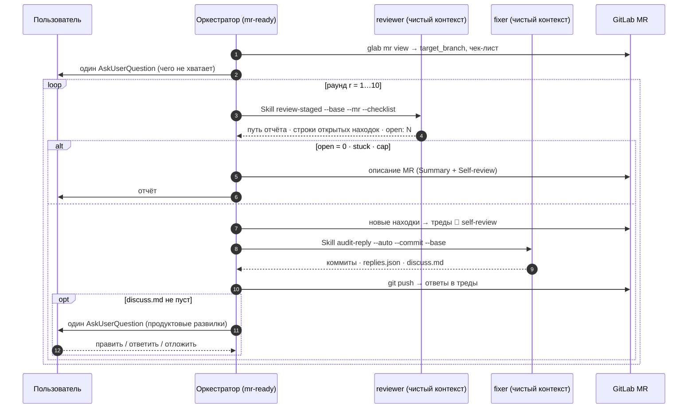

# agents

Личные скиллы и команды для Claude Code.

| Скилл | Что делает |
|---|---|
| [`mr-ready`](skills/mr-ready) | Автономный цикл подготовки MR к ревью человеком; оркестратор держит только состояние, ревью и правки — субагенты с чистым контекстом: `review-staged` → находки тредами в MR (`🤖 self-review`) → `audit-reply --auto --commit` → push, ответы в треды → повтор до чистого ревью (кап 10 раундов). Спрашивает только продуктовые развилки. Единственный скилл, который коммитит, пушит и постит. |
| [`review-staged`](skills/review-staged) | Параллельный ревью диффа (staged / last / branch / worktree) четырьмя ревьюерами по осям — корректность и контракты, правила и запахи, производительность, чек-лист отгрузки: каждая находка обязана нести дословную цитату из файла, остальное режет механический гейт; находки, уже объяснённые в тредах МР, помечаются снятыми, дефекты старше диффа уходят черновиками тикетов. Флаги `--no-mr`, `--no-spec`; код не трогает — только отчёт. |
| [`bugty-hunter`](skills/bugty-hunter) | Охота на баги в одном из трёх скоупов — дифф, модуль (фича, флоу) или проект (3–5 зон на выбор): агент разведки строит карту периметра, следом три агента ищут по осям — состояние и асинхрон, жизненный цикл и утечки памяти, контракты и крайние данные. Каждый баг несёт дословную цитату, прослеженный путь от входной точки, шаги воспроизведения и черновик тикета; что не удалось проследить — уходит в «подозрения» без тикета. Код не трогает. |
| [`review-docs`](skills/review-docs) | Ревью готового документа (ТЗ, дизайн, ресёрч, план) против кода репозиториев, которые он упоминает: шарды по секциям, каждое утверждение с дословной цитатой из файла, механический гейт; ищет неточности, противоречия, слепые пятна и открытые вопросы к автору. |
| [`dev-feedback`](skills/dev-feedback) | Performance feedback на разработчика по merged-МР из GitLab (через `glab`). |
| [`audit-reply`](skills/audit-reply) | Разбирает комментарии аудитора в GitLab MR и по каждому помогает решить — править код или ответить обоснованием (через `glab`). |
| [`bug-flow`](skills/bug-flow) | Баг-тикет Jira: воспроизведение на стенде → комментарий с кейсом → минимальный фикс → комментарий «причина / решение / риски». Wiki через REST (`scripts/jira_put.py`). |
| [`local-debug`](skills/local-debug) | Расставляет `console.warn`-пробы, а если баг только на билде — сниппеты в консоль прод-сборки; диагностирует по логам. |
| [`merge-resolve`](skills/merge-resolve) | Разрешает конфликты git (merge / rebase / cherry-pick / stash) по единому плану. |
| [`perf-review`](skills/perf-review) | Беспощадное performance-ревью работы с Claude Code за N дней. |
| [`tech-task`](skills/tech-task) | Низкоуровневое ТЗ для фронтенд-задачи. |

## Запуск `mr-ready`

Сессия Claude Code в целевом репозитории, на ветке MR, в auto-режиме разрешений. Нужны `glab`,
авторизованный на хосте, и бинарники проверок в репо (`tsc`, `eslint`, `jest` …).



Один слэш-вызов на сообщение, поэтому два сообщения подряд — второе после остановки первого:

```
/goal MR из отчёта mr-ready готов: последний раунд review-staged без открытых находок (нерезолвленный тред с ответом — не находка, резолвит ревьюер), проверки зелёные, ветка запушена, ответы в тредах — либо mr-ready сам сказал «стоп». Чек-лист отгрузки: https://jira.example.com/browse/KEY-1?focusedCommentId=123
```

```
/mr-ready https://git.example.com/group/project/-/merge_requests/41
```

Чек-лист отгрузки — сразу в `/goal` (ссылка на Jira-комментарий или «чек-листа нет»), иначе цикл
встанет на вопросе о нём. URL MR необязателен — найдётся по ветке. Дальше тишина до продуктовой
развилки или отчёта. `/goal clear` — остановить; без `/goal` скилл тоже работает.

## Подключить глобально

```bash
ln -s "$PWD/skills/<name>" ~/.claude/skills/<name>
```

## Команды

| Команда | Что делает |
|---|---|
| [`diff-summary`](commands/diff-summary.md) | Однострочная сводка по дифу (`staged` / `branch` / `working`) — готовая к вставке в описание MR. |

Подключить глобально:

```bash
ln -s "$PWD/commands/<name>.md" ~/.claude/commands/<name>.md
```

## Установить через skills.sh

```bash
# весь репозиторий (CLI сам покажет список скиллов)
npx skills add Segodnya/agents

# конкретный скилл по прямой ссылке
npx skills add https://github.com/Segodnya/agents/tree/main/skills/review-staged
```
