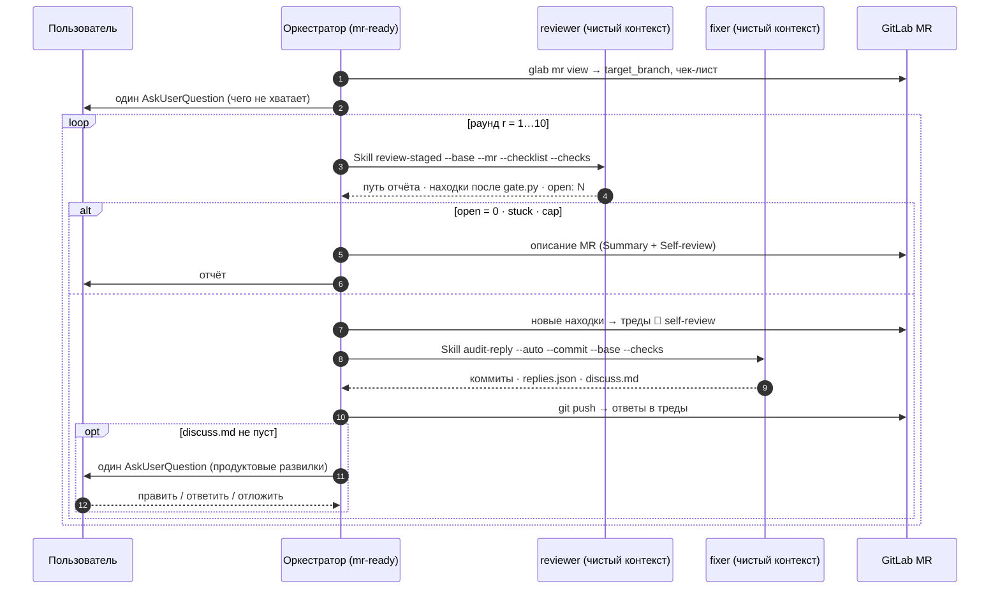

# agents

Личные скиллы и команды для Claude Code.

| Скилл | Что делает |
|---|---|
| [`mr-ready`](skills/mr-ready) | Цикл, в котором независимые агенты доводят MR до мерж-готовых правок: `review-staged` → находки тредами в MR (`🤖 self-review`) → `audit-reply --auto --commit` → push, ответы в треды → повтор до чистого ревью (кап 10 раундов). Оркестратор держит состояние, публикует и решает, когда хватит (`ready` / `stuck` / `cap`). Спрашивает только продуктовые развилки. Единственный скилл, который коммитит, пушит и постит. |
| [`review-staged`](skills/review-staged) | Находит максимум проблем в диффе (staged / last / branch / worktree) и объявляет только доказанные. Четыре ревьюера по осям — корректность и контракты, правила и запахи, производительность, чек-лист отгрузки; на каждый дефект ищут такие же места. Гейт (`_lib/gate.py`, общий с `bugty-hunter`) сверяет цитату каждой находки с реальным файлом и режет остальное; снятое в тредах МР помечается, дефекты старше диффа уходят черновиками тикетов. Флаги `--no-mr`, `--no-spec`; код не трогает — только отчёт. |
| [`bugty-hunter`](skills/bugty-hunter) | Охота на баги в одном из трёх скоупов — дифф, модуль (фича, флоу) или проект (3–5 зон на выбор): агент разведки строит карту периметра, следом три агента ищут по осям — состояние и асинхрон, жизненный цикл и утечки памяти, контракты и крайние данные. Каждый баг несёт дословную цитату, прослеженный путь от входной точки, шаги воспроизведения и черновик тикета; что не удалось проследить — уходит в «подозрения» без тикета. Код не трогает. |
| [`review-docs`](skills/review-docs) | Ревью готового документа (ТЗ, дизайн, ресёрч, план) против кода репозиториев, которые он упоминает: шарды по секциям, каждое утверждение с дословной цитатой из файла, механический гейт; ищет неточности, противоречия, слепые пятна и открытые вопросы к автору. |
| [`dev-feedback`](skills/dev-feedback) | Performance feedback на разработчика по merged-МР из GitLab (через `glab`). |
| [`audit-reply`](skills/audit-reply) | По каждому замечанию ревьюера (треды GitLab MR, отчёт, текст) — правка, которая закрывает его целиком без побочек (все экземпляры паттерна, вызывающие, парная операция, тест с независимым эталоном), или ответ-обоснование. Интерактивно или под `--auto` для `mr-ready`. |
| [`bug-flow`](skills/bug-flow) | Баг-тикет Jira: воспроизведение на стенде → комментарий с кейсом → минимальный фикс → комментарий «причина / решение / риски». Wiki через REST (`scripts/jira_put.py`). |
| [`local-debug`](skills/local-debug) | Расставляет `console.warn`-пробы, а если баг только на билде — сниппеты в консоль прод-сборки; диагностирует по логам. |
| [`merge-resolve`](skills/merge-resolve) | Разрешает конфликты git (merge / rebase / cherry-pick / stash) по единому плану. |
| [`perf-review`](skills/perf-review) | Беспощадное performance-ревью работы с Claude Code за N дней. |
| [`memory-audit`](skills/memory-audit) | Аудит файловой памяти Claude Code по проекту: каждая запись сверяется с кодом, правилами и скиллами, вердикты «оставить / исправить / слить / удалить» применяются после подтверждения (`scripts/memory.py` — инвентарь и пересборка индекса). |
| [`tech-task`](skills/tech-task) | Низкоуровневое ТЗ для фронтенд-задачи. |

## Запуск `mr-ready`

Сессия Claude Code в целевом репозитории, на ветке MR, в auto-режиме разрешений. Нужны `glab`,
авторизованный на хосте, и бинарники проверок в репо (`tsc`, `eslint`, `jest` …).


```mermaid
sequenceDiagram
    autonumber
    participant U as Пользователь
    participant O as Оркестратор (mr-ready)
    participant R as reviewer (чистый контекст)
    participant F as fixer (чистый контекст)
    participant G as GitLab MR

    O->>G: glab mr view → target_branch, чек-лист
    O->>U: один AskUserQuestion (чего не хватает)
    loop раунд r = 1…10
        O->>R: Skill review-staged --base --mr --checklist --checks
        R-->>O: путь отчёта · находки после gate.py · open: N
        alt open = 0 · stuck · cap
            O->>G: описание MR (Summary + Self-review)
            O->>U: отчёт
        else
            O->>G: новые находки → треды 🤖 self-review
            O->>F: Skill audit-reply --auto --commit --base --checks
            F-->>O: коммиты · replies.json · discuss.md
            O->>G: git push → ответы в треды
            opt discuss.md не пуст
                O->>U: один AskUserQuestion (продуктовые развилки)
                U-->>O: править / ответить / отложить
            end
        end
    end
```

Один слэш-вызов на сообщение, поэтому два сообщения подряд — второе после остановки первого:

```
/goal mr-ready выдал финальный отчёт по MR. Чек-лист отгрузки: https://jira.example.com/browse/KEY-1?focusedCommentId=123
```

```
/segodnya-agents:mr-ready https://git.example.com/group/project/-/merge_requests/41
```

Чек-лист отгрузки — сразу в `/goal` (ссылка на Jira-комментарий или «чек-листа нет»), иначе цикл
встанет на вопросе о нём. URL MR необязателен — найдётся по ветке. Дальше тишина до продуктовой
развилки или отчёта. Что считать готовым, решает скилл, цель только не даёт остановиться посреди
цикла. `/goal clear` — остановить; без `/goal` скилл тоже работает.

## Команды

| Команда | Что делает |
|---|---|
| [`diff-summary`](commands/diff-summary.md) | Однострочная сводка по дифу (`staged` / `branch` / `working`) — готовая к вставке в описание MR. |

## Установка

Репозиторий — плагин Claude Code `segodnya-agents` и одновременно маркетплейс с ним. Ставится только
целиком: скиллы вызывают скрипты друг друга (`SKILL_DIR/../audit-reply/…`) и общий код из
`skills/_lib/` (`glab_mr`, `run`, `jira`, `gate`), так что отдельный скилл без соседей не запустится.

```
/plugin marketplace add Segodnya/agents
/plugin install segodnya-agents@segodnya-agents
```

Скиллы и команды получают префикс плагина: `/segodnya-agents:mr-ready`,
`Skill segodnya-agents:review-staged`. Новые коммиты приходят по `/plugin marketplace update
segodnya-agents` или автоматически, если включить auto-update для маркетплейса в `/plugin` →
Marketplaces. `version` в `plugin.json` нет намеренно — с ним обновления приходили бы только при его
смене.

## Локальная разработка

Подключи чекаут как локальный маркетплейс — Claude Code читает файлы прямо из него, без копии в кэш:

```bash
claude plugin marketplace add ~/path/to/agents
claude plugin install segodnya-agents@segodnya-agents
```

- Правка подхватывается в новой сессии или по `/reload-plugins` в текущей; `version` поднимать не нужно.
- Ветку или worktree на одну сессию: `claude --plugin-dir ~/path/to/worktree`.
- Перед проверкой: `claude plugin validate .` — манифесты и пути.
- Старые симлинки скиллов из `~/.claude/skills` (и `~/.agents/skills`, если ставил через skills.sh)
  удали, иначе каждый скилл загрузится дважды — без префикса и с ним.
